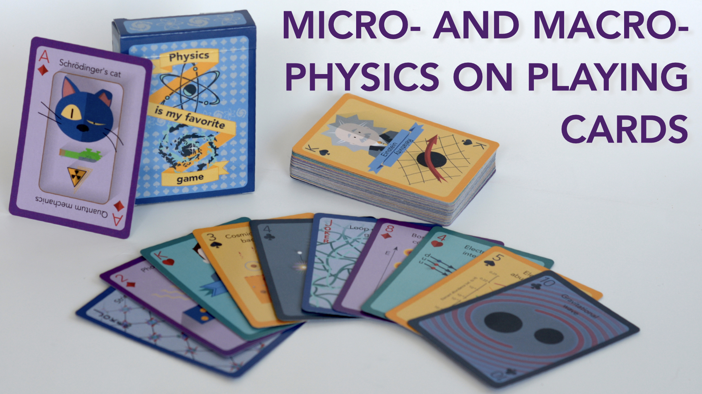

# Physics is my favorite game 

Please visit my Kickstarter page:

https://www.kickstarter.com/projects/physicscards/playing-cards-about-fundamental-physics

This book is the support material for the deck of playing cards all about physics, from the elementary particles to the entire Universe.

This work is licensed under the Creative Commons Attribution-NonCommercial 4.0 International License. To view a copy of this license, visit http://creativecommons.org/licenses/by-nc/4.0/ or send a letter to Creative Commons, PO Box 1866, Mountain View, CA 94042, USA.